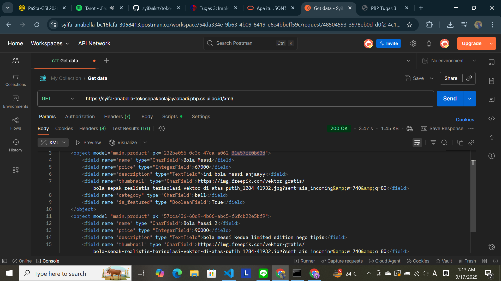
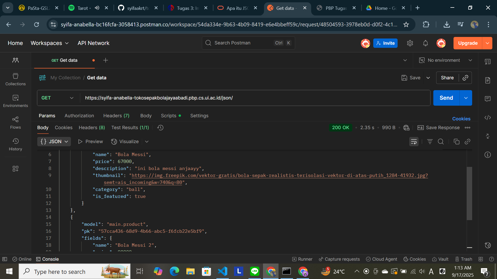
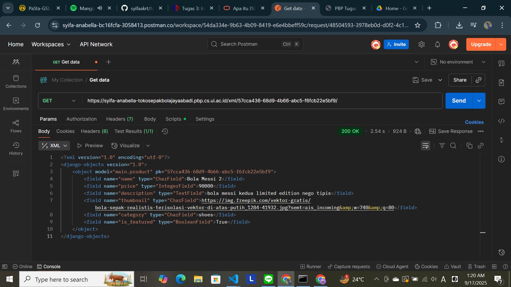
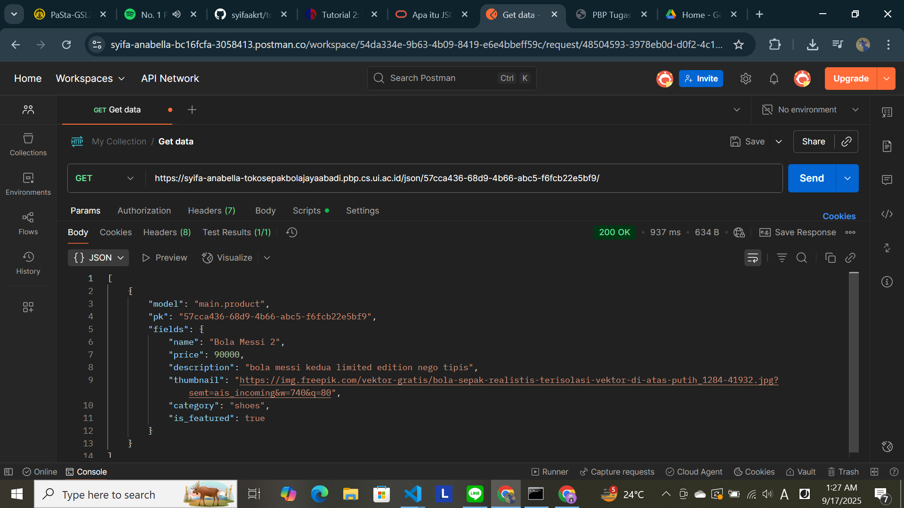

# Tugas 2

1) Jelaskan bagaimana cara kamu mengimplementasikan checklist di atas secara step-by-step (bukan hanya sekadar mengikuti tutorial). 
Saya memulai dengan menganalisis kode tutorial 1 yang kemarin sudah disampaikan, memahami dengan detail mengenai setiap barisnya, setelah itu kembali mengimplementasikannya ke dalam project baru. 

2) Buatlah bagan yang berisi request client ke web aplikasi berbasis Django beserta responnya dan jelaskan pada bagan 
tersebut kaitan antara urls.py, views.py, models.py, dan berkas html.
https://drive.google.com/file/d/1ix1VDBU9cDCMaXzoDPKGfZhtf1i8gfCz/view?usp=sharing

urls.py bertugas untuk melakukan routing, atau mengarahkan ke berkas views.py, apabila url yang diminta cocok dengan pola routing. Setelah itu, views.py mengambil data dari models.py dan memilih template html untuk menampilkan data.

3) Jelaskan peran settings.py dalam proyek Django!
Sebagai pusat konfigurasi dalam implementasi proyek. misalnya, INSTALLED untuk list aplikasi yang dipakai, DATABASES untuk mengatur database, mengatur path template, dll. 

4) Bagaimana cara kerja migrasi database di Django?
Migrasi berguna untuk melakukan sinkronisasi model python dengan strktur tabel database. jadi, ketika ada perubahan pada model, maka perllu dilakukan migrasi agar Django dapat membaca perubahan yang terjadi dan menyesuaikannya dengan tabel database

5) Menurut Anda, dari semua framework yang ada, mengapa framework Django dijadikan permulaan pembelajaran pengembangan perangkat lunak?
Karena Django menggunakan bahasa python yang merupakan bahasa pertama yang dipelajari oleh kebanyakan pemula atau orang-orang yang baru saja terjun ke pemrograman. Selain itu, Django juga menggunakan pola MVT yang biasa digunakan dalam industri

6) Apakah ada feedback untuk asisten dosen tutorial 1 yang telah kamu kerjakan sebelumnya?
Tidak ada, penjelasan sangat jelas dan sudah sangat cukup membantu

# Tugas 3

1) Jelaskan mengapa kita memerlukan data delivery dalam pengimplementasian sebuah platform?
Karena dalam pengimplementasian sebuah platform, diperlukan adanya transfer data antar sistem atau layanan lain. Data delivery dibutuhkan dalam memastikan data dipindahkan dan dapat diakses dengan efisien dan akurat antar berbagai komponen sistem atau pengguna akhir. 

Selain itu, data delivery juga penting dalam menjaga akuntabilitas dan konsistensi, dimana pengiriman data yang terstruktur memastikan data yang dikirim konsisten sehingga sesuai dengan format yang diharapkan dan dapat diolah datanya dengan baik, untuk kepentingan platform selanjutnya. Integrasi antar sistem menjadi mudah, pengambilan keputusan dapat dilakukan dengan lebih cepat, dan hal ini juga dapat meningkatkan pengalaman pengguna karena kecepatan pengiriman data yang cepat dan terstrukur memungkinkan aplikasi dalam memberikan respons yang cepat, seperti dalam menampilkan konten, gambar, status, dll.

2) Menurutmu, mana yang lebih baik antara XML dan JSON? Mengapa JSON lebih populer dibandingkan XML?
Keduanya memiliki kelebihan dan kekurangannya masing^masing. terdapat beberapa hal mengapa json menjadi lebih populer:
    a) Ringan dan lebih cepat
        Json lebih singkat dan sederhana jika dibandingkan dengan xml, ukurannya juga lebih kecil sehingga trensfer data menjadi lebih cepat
    b) Mudah dibaca
        Json memiliki struktur yang lebih 'clean' dan mudah dipahami
    c) Didukung oleh banyak browser/platform
        Hampir semua browser modern saat ini dapat memproses data json dengan lancar, sehingga user dapat mengakses berbagai website tanpa masalah

3) Jelaskan fungsi dari method is_valid() pada form Django dan mengapa kita membutuhkan method tersebut?
Fungsi ini memastikan field yang diisi oleh user sesuai dengan ketentuan yang telah ditetapkan oleh developer. Django akan mengecek setiap field form berdasarka tipe data, kewajiban mengisi, panjnag maksimal, format khusus, atau validasi kustom lainnya. Jika form tidak valid (atau mengembalikan False), Django akan menyimpan pesan error di form.errors yang dapat ditampilakn ke user. 

Method ini sangat dibutuhkan karena dapat memberikan kemudahan dalam melakukan validasi atas input user yang memerlukan beberapa penyesuain, sehingga developer tidak perlu menambahkan banyak logika tambahan untuk melakukan validasi tersebut. Data yang masuk dijamin aman dan sesuai aturan, pemrosesan data selanjutnya juga menjadi mudah, dan developer dapat lebih mudah dalam menampilkan feedback user. 

4) Mengapa kita membutuhkan csrf_token saat membuat form di Django? Apa yang dapat terjadi jika kita tidak menambahkan csrf_token pada form Django? 
csrf merupakan token keamanan yang unik untuk setiap form. Token ini digunakan untuk memastikan bahwa request POST yang diterima berasal dari situs kita sendiri, bukan dari pihak ketiga lainnya yang berusaha berbuat jahat. csrf sangat dibutuhkan karena dapat mencegah serangan dari penyerang yang membuat request palsu, misalnya dalam mengganti password, menghapus data, atau melakukan transaksi. 

Token unik ini memberikan kepastian bahwa hanya request yang sah yang bisa memodifikasi data. Tanpa token ini, situs akan menjadi lebih rentan terhadap manipulasi oleh pihak ketiga. Jika tidak menambahkab csrf_token, maka form POST akan gagal diproses dengan menampilkan error 403, dan sistem menjadi sangat rentan atas serangan 

5) Bagaimana hal tersebut dapat dimanfaatkan oleh penyerang?
Penyerang dapat melakukan request palsu yang seolah-olah dilakukan oleh user. csrf dapat mengidentifikasi asal request apakah berasal dari situs atau pihak ketiga lainnya. Contohnya, ketika ada request palsu untuk mengganti password user, hal tersebut dapat menjadi masalah karena penyerang dapat mengotak-atik data pribadi user asli, hingga menggunakan asset berharga lainnya. Di sisi lain, user tersebut tidak dapat mengakses akunnya sendiri karena password telah diganti

6) Jelaskan bagaimana cara kamu mengimplementasikan checklist di atas secara step-by-step (bukan hanya sekadar mengikuti tutorial).
Saya mencoba untuk membuka tutorial dari awal (0-2) dan benar-benar memahami maksud setiap kode. saya menggunakan bantuan internet dan ai dalam mendalami setiap baris kode, serta tidak lupa dalam mencari sumber yang kredibel. Dalam beberapa hal, saya juga mencoba untuk melakukan modifikasi agar dapat memastikan tingkat pemahaman saya.

7) Apakah ada feedback untuk asdos di tutorial 2 yang sudah kalian kerjakan?
Tidak ada, penjelasan sangat jelas dan sangat membantu.

hasil akses POSTMAN

# Tugas 4
1) Apa itu Django AuthenticationForm? Jelaskan juga kelebihan dan kekurangannya.
2) Apa perbedaan antara autentikasi dan otorisasi? Bagaiamana Django mengimplementasikan kedua konsep tersebut?
3) Apa saja kelebihan dan kekurangan session dan cookies dalam konteks menyimpan state di aplikasi web?
4) Apakah penggunaan cookies aman secara default dalam pengembangan web, atau apakah ada risiko potensial yang harus diwaspadai? Bagaimana Django menangani hal tersebut?
5) Jelaskan bagaimana cara kamu mengimplementasikan checklist di atas secara step-by-step (bukan hanya sekadar mengikuti tutorial).